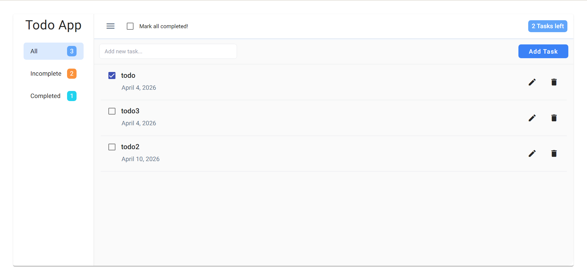

# Angular Todo App

Simple Todo application built with Angular.

---

## Features

* Add new tasks
* Mark single or all tasks as complete/incomplete
* Edit existing tasks
* Delete tasks
* Data persistence using LocalStorage
* Responsive design

---

## Tech Stack

* Angular
* TypeScript
* HTML5
* Tailwind CSS
* RxJS

---

## Installation

Clone the repository:

```bash
git clone https://github.com/Geeta16-97/angular-todo-app.git
cd angular-todo-app
```

Install dependencies:

```bash
npm install
```

Run the app:

```bash
ng serve
```

Open in your browser:

```text
http://localhost:4200
```

---

## Live Demo



---

## Screenshot

https://geeta16-97.github.io/angular-todo-app/

---

## License

This project is licensed under the MIT License.
